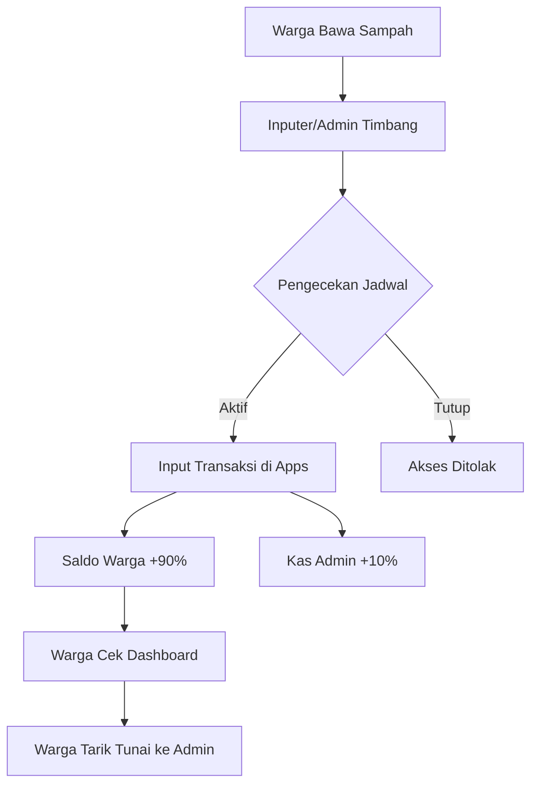

# ♻️ Bank Sampah Waniluru

**Bank Sampah Waniluru** adalah sistem manajemen operasional bank sampah berbasis digital yang dirancang untuk mendigitalisasi pencatatan transaksi, pengelolaan tabungan warga, dan pengawasan sistem secara transparan. Dibangun menggunakan Python dan Streamlit untuk antarmuka yang modern dan responsif.

---

## 🏛️ Arsitektur & RBAC (Role-Based Access Control)

Aplikasi ini menggunakan sistem hak akses berlapis untuk memastikan keamanan data dan pemisahan tugas yang jelas.

### 👥 Matriks Hak Akses

| Fitur | Superuser | Admin (Panitia) | Inputer | Warga |
| :--- | :---: | :---: | :---: | :---: |
| Dashboard Statistik | ✅ | ✅ | ❌ | ✅ (Pribadi) |
| Input Transaksi | ✅ | ✅ | ⚠️ (Terjadwal) | ❌ |
| Kelola User/Warga | ✅ | ✅ | ❌ | ❌ |
| Kelola Keuangan (WD/Depo) | ✅ | ✅ | ❌ | ❌ |
| Kelola Harga & Kategori | ✅ | ✅ | ✅ | ❌ |
| Audit Log | ✅ | ❌ | ❌ | ❌ |
| Login Sebagai User Lain | ✅ | ❌ | ❌ | ❌ |
| Fitur Reset/Dummy Data | ✅ | ❌ | ❌ | ❌ |

---

## ⚙️ Manajemen Sistem (System Management)

### 1. 📅 Pengaturan Jadwal Input (Inputer Control)
Fitur ini memungkinkan Admin/Superuser untuk mengontrol operasional role **Inputer**.
- **Mode Manual:** Mengaktifkan atau menonaktifkan form input secara instan.
- **Mode Terjadwal:** Otomasi berdasarkan jam operasional (Mulai-Selesai), hari dalam seminggu, atau tanggal-tanggal tertentu dalam satu bulan.
- **Tujuan:** Mencegah input data di luar jam kerja resmi atau periode penimbangan.

### 2. 📜 Audit Logging
Setiap tindakan kritis dicatat dalam tabel `audit_logs` untuk akuntabilitas.
- **Aktivitas yang dicatat:** Login, Create/Update User, Perubahan Harga, Transaksi Baru, Setor/Tarik Tunai, dan Perubahan Jadwal.
- **Detail:** Mencatat Timestamp, ID User, Tipe Aksi, dan Detail Deskripsi.

### 3. � Skema Bagi Hasil (Revenue Model)
Sistem secara otomatis menghitung pembagian hasil transaksi:
- **Warga (90%):** Masuk ke saldo tabungan warga sebagai pendapatan bersih.
- **Admin/Bank Sampah (10%):** Dialokasikan sebagai biaya operasional bank sampah.
- *Skema ini dapat dikembangkan di sisi database/utils untuk persentase yang dinamis.*

---

## 🛠️ Detail Teknis & Pengaturan

### �️ Database Schema (SQLite)
- `users`: Data profil, kredensial (hashed password), dan role.
- `categories`: Daftar sampah dan harga per kilogram.
- `transactions`: Log setoran sampah (berat, nominal, fee).
- `financial_movements`: Log mutasi saldo (tarik tunai/deposit tunai).
- `system_settings`: Key-value pair untuk konfigurasi scheduler dan status manual.
- `audit_logs`: Rekam jejak aktivitas sistem.

### 🚀 Instalasi Cepat

1. **Persiapan Lingkungan**
   ```bash
   pip install streamlit pandas matplotlib fpdf2
   ```

2. **Menjalankan Aplikasi**
   ```bash
   streamlit run app.py
   ```

3. **Akun Default**
   - **Username:** `admin`
   - **Password:** `admin123`

---

## 📑 Alur Kerja Inti (Core Flow)



---

## 📦 Deliverables Dokumentasi Lainnya
- `FITUR_APPS.md`: Rincian fitur setiap modul.
- `ALUR_PENGGUNAAN.md`: Panduan alur bisnis sistem.
- `TUTORIAL_*.md`: Panduan khusus untuk setiap role pengguna.
